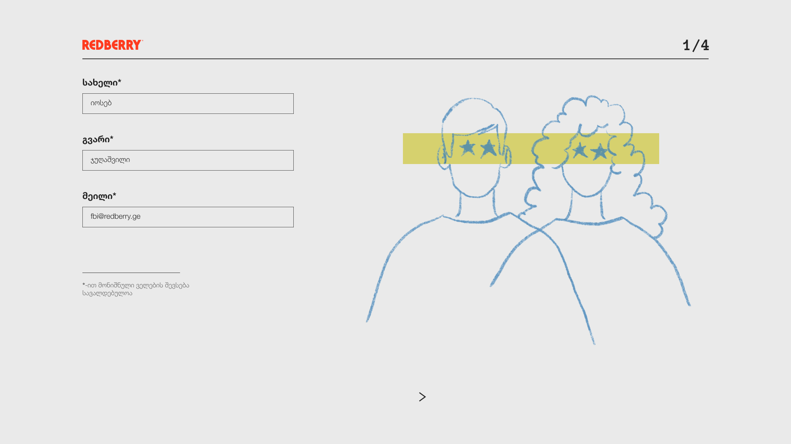

This is a project for the Redberry International Bootcamp 2022-2023. The project is a web application about covid questionnaire. The application is built using ReactJS.

## used technologies

- ReactJS
- Redux-toolkit
- Styled-components
- Typescript
- React-hook-form
- Only Desktop Version

## screenshots

